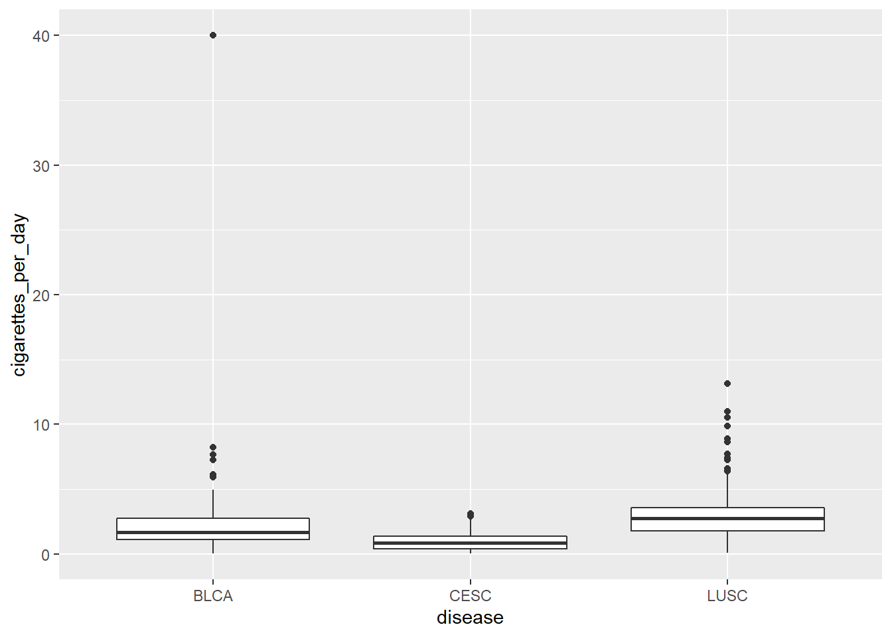
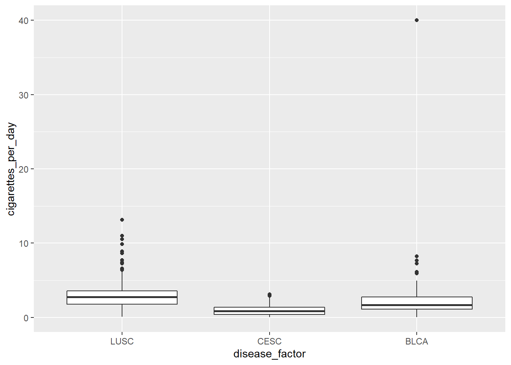
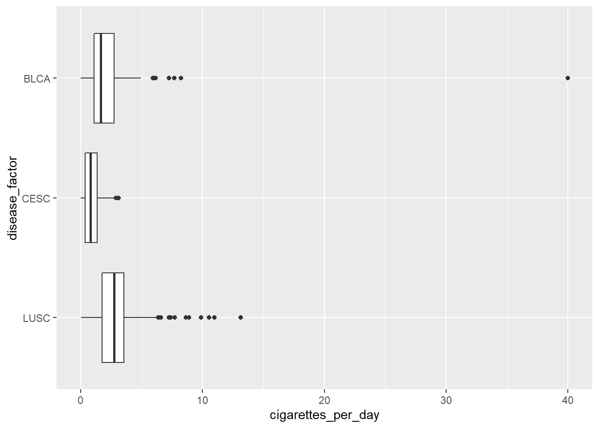
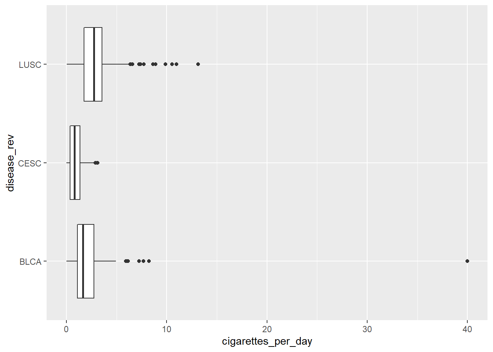
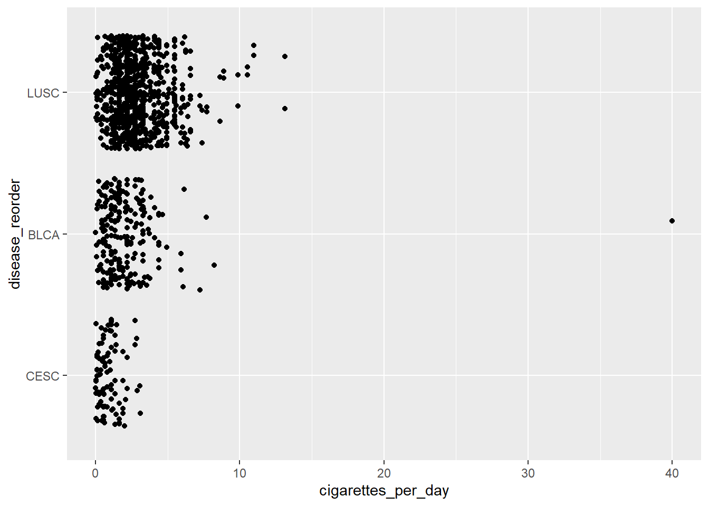

# More about Factors

This was part of a impromptu session learning about factors.


```r
# load libraries
library(tidyverse)
library(readxl)
library(janitor)
library(forcats)

smoke_complete <- read_excel("data/smoke_complete.xlsx", 
                             sheet=1, 
                             na="NA")
```

## Making a factor variable out of disease

We're adding a fourth value, `BRCA` to our levels here.


```r
smoke_complete2 <- smoke_complete %>% 
    mutate(disease_factor = 
               factor(disease,
                      levels = c("LUSC", "CESC", "BLCA", "BRCA")
                      )
           ) 
```

## Using the character variable


```r
ggplot(smoke_complete2) + 
  aes(x=disease, y=cigarettes_per_day) +
  geom_boxplot()
```



## Compare to the factor variable


```r
ggplot(smoke_complete2) + aes(x=disease_factor, y=cigarettes_per_day) +
  geom_boxplot()
```



## Another thing about factors

Factor `levels` also specify the permissible values. 

In this example, `LUSC` and `BRCA` are the permissible values. We pass a character vector into them, and you can see those values (`BLCA`, `CESC`) are recoded as NAs


```r
character_vector <- c("LUSC", "LUSC", "BRCA", "BLCA", "BRCA", "CESC", "CESC")

factor_vector <- factor(character_vector, levels=c("LUSC", "BRCA"))

factor_vector
```

```
## [1] LUSC LUSC BRCA <NA> BRCA <NA> <NA>
## Levels: LUSC BRCA
```

## `fct_rev()` - reversing the order of a factor

Very useful when using factors on the y-axis, because the default ordering is first value at the bottom, rather than first value at the top.


```r
library(forcats)

#fct_rev()

smoke_complete3 <- smoke_complete2 %>%
  mutate(disease_rev = fct_rev(disease_factor))

#show original factor
ggplot(smoke_complete3) + aes(y=disease_factor, x=cigarettes_per_day) +
  geom_boxplot()
```



```r
#show factor with reversed order
ggplot(smoke_complete3) + aes(y=disease_rev, x=cigarettes_per_day) +
  geom_boxplot()
```



## `fct_reorder()`

`fct_reorder()` lets you reorder factors by another `numeric` variable.


```r
library(forcats)

#fct_rev()

smoke_complete3 <- smoke_complete2 %>%
  mutate(disease_reorder = fct_reorder(disease_factor, cigarettes_per_day))

ggplot(smoke_complete3) + aes(y=disease_reorder, x=cigarettes_per_day) +
  geom_jitter()
```



## `fct_collapse`

`fct_collapse()` lets you collapse multiple categories into one category.


```r
smoke_complete3 %>% 
  mutate(disease_collapse = fct_collapse(
    disease_factor,
    other = c("BLCA", "CESC"),
    LUSC = c("LUSC")
  )) %>%
  tabyl(disease_collapse)
```

```
##  disease_collapse   n   percent
##              LUSC 836 0.7256944
##             other 316 0.2743056
##              BRCA   0 0.0000000
```

## Other really useful `forcats` functions

`fct_recode()` - lets you recode values manually.

`fct_other()` - lets you define what categories are in an `other` variable. 
