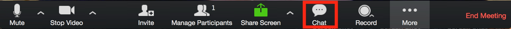

```{r xaringan-themer, include = FALSE}
library(xaringanthemer)
mono_light(
  base_color = "midnightblue",
  header_font_google = google_font("Josefin Sans"),
  text_font_google   = google_font("Montserrat", "300", "300i"),
  code_font_google   = google_font("Droid Mono"),
  link_color = "deepskyblue1",
  text_font_size = "28px"
)
```

class: center, middle

```{r setup, include=FALSE}
options(htmltools.dir.version = FALSE)
```
# Welcome

---
# Ted Laderas, PhD 

.pull-left[
- Assistant Professor, Division of Bioinformatics and Computational Biology, Department of Medical Informatics and Clinical Epidemiology 
- Bioinformatics/Computational Biology
- Interactive Visualization
- Certified RStudio Instructor 
- Co-founder of [BioData Club](http://biodata-club.github.io)]

.pull-right[]

---
# Class Facilitator/TA

- Meet Aaron Coyner, PhD Candidate
- He will be helping me faciliate online sessions

---
# Introduction Overview

- Introduction to Zoom
- Learning Objectives
- Class Logistics

---
# First of All

- This is a brand new course
- Let's support each other
    - Be gentle with each other
- I expect to make many mistakes
    - I don't mind you pointing them out, but be gentle
    - You can end up as a collaborator!

---
# Tour of Zoom

- We'll be using zoom for our classes
- Let's do a quick guided tour

---

<iframe width="1000" height = "600" src="https://www.youtube.com/embed/5iap0Ffl5Lg" frameborder="0" allow="accelerometer; autoplay; encrypted-media; gyroscope; picture-in-picture" allowfullscreen></iframe>

---
# Let's Try Out Chat

Open the chat window (if we are in full screen, press the escape key, and then click on the chat icon)



Type in Chat:

- Your Name
- Your Department/Program
- What you hope to learn from this course

---
# Rules for Interaction

During Lectures:

- Post questions in Chat
    - Aaron will interrupt me to make sure these questions are answered
- Post answers to questions in chat

---
# Rules for Interaction

During Labs:

- Work within your breakout group to solve 
- Share screens to talk about issues
- We'll pop in to each discussion group to help you out

---
# Sharing Your Screen


---
# Breakout Rooms

- I'll divide the class into breakout rooms for discussion and labs
- I'll ask each room for a summary

---
# Let's try the Breakout Rooms

- Let's try it (3 minutes)
- Icebreaker: What is your favorite all purpose condiment (such as salsa, ketchup, or chile oil?) and why?

---
# Zoom Recordings/Attendance

- I will record each session and post it as soon it is ready
- I will pause recording for breakout rooms (that won't be recorded)

---
class: center, middle

# Let's look at the website:
## http://ready4r.netlify.com

---
class: center, middle

# Class Logistics

---
# Learning Objectives

By the end of this course you will be able to:

1. **Understand** and **utilize** **R/RStudio**.
2. **Understand** basic data types and data structures in R.
3. **Familiarize** and **load** data files (Excel, Comma Separated Value files) into R/Rstudio, with tips on formatting.
4. **Visualize** datasets using **ggplot2** and understand how to build basic plots using **ggplot2** syntax.
5. **Filter** and **format** data in R for use with various routines.
6. **Execute** and **Interpret** some basic statistics in R.

---
# My Approach to Teaching

I think students learn the best when they're actually looking and thinking about data.

This means we will be looking at lots of data.

I also think that we learn best when we are discussing data together.

---
class:center, middle
# This is a Safe Space to Ask Questions

---
# Code of Conduct

This class is governed by the [BioData Club Code of Conduct](https://biodata-club.github.io/code_of_conduct/).

This class is meant to be a psychologically safe space where it's ok to ask questions.

I want to normalize your own curiosity and fuel your desire to learn more.

If you are disruptive to class learning or disparaging to other students, I may mute you for the day.

---
# Class Slack

I have created a class Slack here: http://ready4r.slack.com - the invite link will be sent out.

I will try to answer questions there when I can. We'll take a tour of class next week.

I am inviting external people who are intereseted in learning R as well, but you will have your own private channel and get priority.

If you have a question, please ask it in a public channel, rather than a private message, so it can benefit everyone.

- [Slack 101 Videos](https://slack.com/resources/slack-101)

---
# Class Attendance Policy

Please try to attend class. 

There is a post-class survey that will be posted in each notebook. 

Please fill it out, as it counts as attendance.

---
# Office Hours

I will be available for office hours/drop in time 2 Hours a week (Aaron will be available once a week). You're free to sign in to the Zoom Room and work on homework at this time.

The when is good link was sent out as an announcement

---
# One Note about Scheduling

I only work 4 days a week. I'm not available on Wednesdays.

---
# Class Assignments

Class Assignments will be done in RStudio Notebooks (more during lab)

Assignments will be submitted through Sakai. 

We will do our best to return it to you 1 week after due date

---
# Why R?

R is an extremely powerful language for **statistical modeling**, machine learning, data manipulation, and visualization.

It's a *hub* language in that you can access many different kinds of systems (TensorFlow, Databases, Apache Spark) without needing to know other languages.

---
# R is Not Easy

- Learning R can be a difficult, but rewarding process
- Be patient with yourself, don't beat yourself up
- We'll try to make it a fun process for you

---

# Grading Breakdown

Class is Pass/Fail

- In class activities 30%
- Assignments (from labs) 50%
- Final Project 20%

---
# Format of Class

- Lecture/Labs (1 1/2 hours)

- Office Hours (2 hrs/week)

---
# R and RStudio

- In-class labs and assignments will be done with [RStudio.cloud](http://rstudio.cloud)
- Submissions of notebooks will be via Sakai (we will talk about this)

---
# Post-Class Survey

Filling this out is required and counts towards your attendance.

https://ohsu.ca1.qualtrics.com/jfe/form/SV_6nc1ZLFMmRoE7nn

---
class: center, middle

# Any Questions?