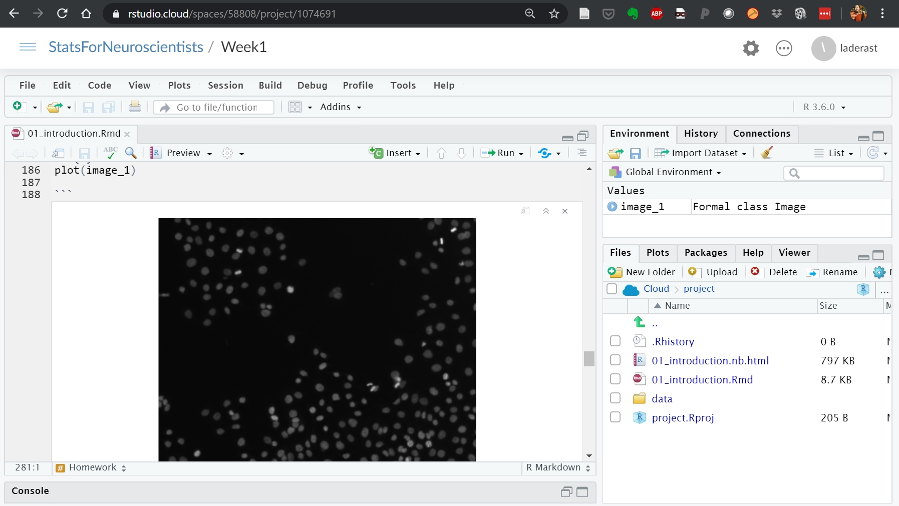
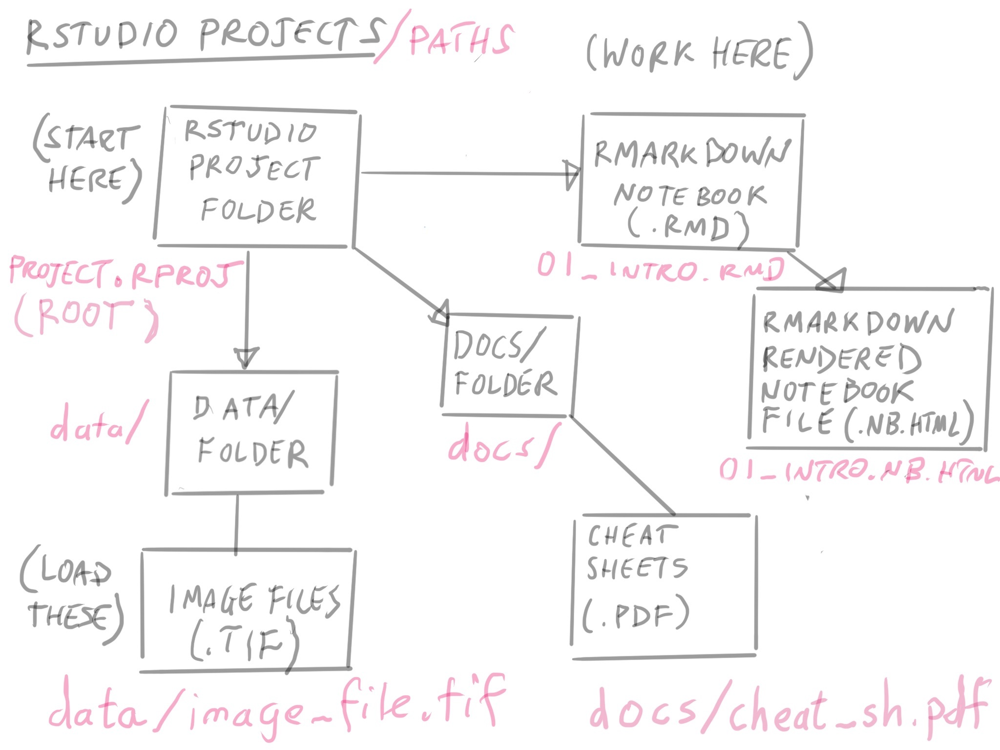
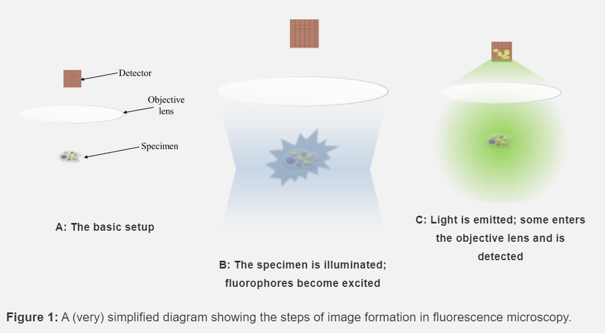
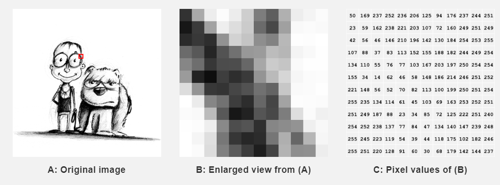
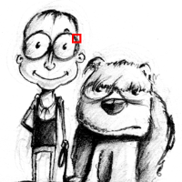
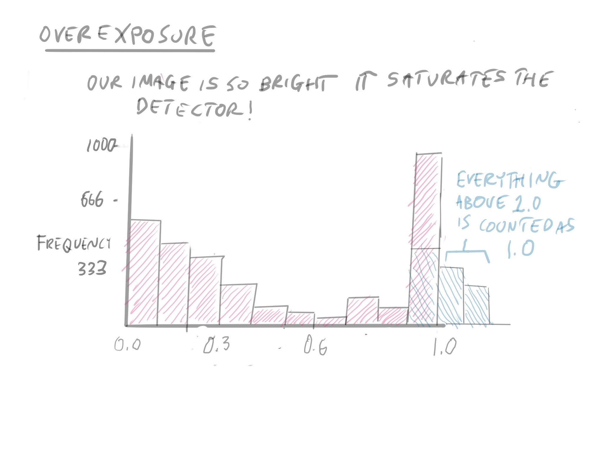
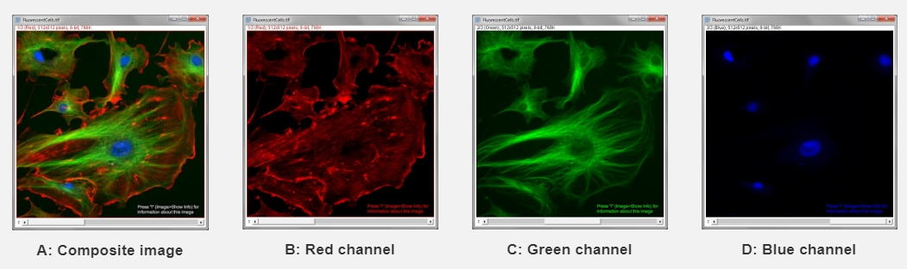

```{r setup, include=FALSE}
options(htmltools.dir.version = FALSE)
```

```{r xaringan-themer, include = FALSE}
library(xaringanthemer)
mono_light(
  base_color = "midnightblue",
  header_font_google = google_font("Josefin Sans"),
  text_font_google   = google_font("Montserrat", "300", "300i"),
  code_font_google   = google_font("Droid Mono"),
  link_color = "deepskyblue1",
  text_font_size = "28px"
)
```

# Reminder

If you want to look at my speaker notes in the presentation, open the link to the presentation and type in "p" to get into presenter mode

Press "p" to get out of presenter mode or you can just reload the presentation

---

# Learning Objectives

- **Understand** the Structure of an RStudio Project
- **Understand** how confocal microscope images are acquired by a system
- **Learn** about how images are represented 
- **Learn** about the types of numeric values we can use as intensities in an image
- **Learn** about histograms and what they can tell us about an image

---
class: center, middle

Let's talk about RStudio Cloud paths

---
# RStudio Cloud



???

- Web based version of RStudio
- All software is installed for you

---


???

- Projects have a root (where the `.rproj` file lives)
- Projects have a `data/` folder
- RMarkdown notebooks live in the root folder (`.Rmd` files)
- Rendered RMarkdown notebooks are `.nb.html` files

---


???
- Images should be in the `data/` folder (`.tif` files)
- if we want to use an image called `image.tif` that is in the ``data` folder, we refer to it by `data/image.tif` in our notebook.

---


???

- Optionally, we can have a `docs` folder
- We'll put slides and cheat sheets here

---
# Thursday's Lab

- Learning R/RStudio
- Loading images
- Making histograms

---
class: center, middle
## Let's talk about image acquisition

---


???

- Depending on the amount of observed fluoresence, our detector (our camera) can quantify it as a number.

---
# Detecting Things

- Our overall focus in this course is in **detecting** cells and cellular proteins and their location in an image.
- What are some cellular structures we'd like to detect? (Type them in chat)

---
# What are Images?

 
]

.footnote[https://petebankhead.gitbooks.io/imagej-intro/content/chapters/images_and_pixels/images_and_pixels.html]

???
- Images are represented as a **matrix** (also known as an array) of numbers
- Horizontal Lines of an image correspond to *rows* in the table
- Vertical Lines of an image correspond to *columns* of the table

---
# Arrays

Images are an example of what is called a *matrix* or a 2 dimensional *array*.

An array has *columns*, and *rows*

---
# Columns and Rows

This is a 200 x 200 pixel image



200    x   200  
*Columns* x *Rows*  

*200 x 200 pixels* is also called the **resolution** of the image.

---
# Where is [1, 1]?

.pull-left[
Top left corner of the image is always referred to as [1,1]
]

.pull-right[
```{r echo=FALSE}
image <- EBImage::readImage("image/week1/kid_example.tif")
plot(image)
```
]

---
# Subsetting an Image

.pull-left[

]

.pull-right[


]

???

If we wanted to get the bottom left quadrant of the photo, we want a subimage of 100 x 100 pixels. 

Well, we can use technique called *subsetting* to get this quadrant.

We want the first 100 columns and the last 100 rows of our image. How do we refer to this?

---


???

- If our loaded image is called `image`, we use the bracket (`[,]`) notation to refer to *rows* and *columns* in it. The notation is [column, row]

- One thing to note. This is a computer graphics standard and it's opposite to how other data structures in R work. They are usually [row, column]

---


???

- The `51:100` and `1:50` are called **sequences**. They are a short hand for *every number between* 51 and 100 (including 51 and 100).

---
# Your Turn

Question: What does the sequence `1:50` refer to in the statement 

```
image[1:50,51:100]
```

? Is this sequence referring to the rows or columns?

Place answer in chat.

---


???

- In the lower left of the diagram, you'll see where each part of the sequence aligns to.
- Our subset is the bottom left.

---
# Your Turn

If we have a 200 x 200 pixel image, how do we refer to the top right quadrant? (use the format `image[a:b, x:y]`)

Place answer in chat

---
# Intensity

The numeric value at a particular pixel represents the intensity of light at that particular image.

These numeric values can either be:

- A unsigned Integer (0-127)
  - Usually used when images are acquired by an instrument
- Decimal values (also known as `double`) (0.156, 0.630, etc)   
  - ranges from 0 to 1
  - This is usually what we'll use

---
# Transformed images

- Usually have decimal values (0.1, 0.33, 0.555), etc
- Usually range from 0 to 1
- File size can be larger than integer-valued images

---


???

One of our most useful tools for understanding an image is the **intensity histogram**.

Our x-axis is our intensity value, and our y-axis are the number of pixels in our image that have that particular intensity value.

--- 


???

Each box represents the number of pixels in that intensity range

---
# What can you tell from this histogram?

```{r echo=FALSE}
hist(image)
```

---
# Your Turn

.pull-left[
- Are the pixel values *floating point* or *integer*?
- What is the maximum observed value in the image?
]

.pull-right[
```{r echo=FALSE}
hist(image)
```
]
---



---
# Color images 

Color images are usually represented by three different intensity values, that are stored in separate *layers* within the file: 

- one for Red 
- one for Blue
- one for Green

---
# Multi-Channel images



???

- Sometimes you use a different stain/antibody to label different proteins. Then the different intensity values correspond to **channels**.
- We often do this when we're interested in quantifying whether two proteins are *co-located*. 
- To do this, we will need to process each channel separately, and then combine the results in the end.

---
# Accessing layers

If an image has multiple channels, you'll access them with an additional entry for the image

```
image[100:150, 1:50, 2]
                     ^
                     this refers to channel 2!
```

---
class: center, middle

# Image Processing Workflow

---


,footnote[https://petebankhead.gitbooks.io/imagej-intro/content/chapters/colors/colors.html]

???

The first five weeks of class we'll focus on *image processing* - getting our images to the point that we can quantify them. 

The last five weeks of class we'll talk about spatial statistics and experimental design.

---
# Reminder

Take the post-lecture survey: https://ohsu.ca1.qualtrics.com/jfe/form/SV_e99ek34B878dGap

This counts as attendance.

---
# Reading 

- [R and RStudio Basics](https://ismayc.github.io/rbasics-book/3-rstudiobasics.html) - make sure to watch the videos
- [Images and Pixels](https://petebankhead.gitbooks.io/imagej-intro/content/chapters/images_and_pixels/images_and_pixels.html)
- [Types and Bit Depths](https://petebankhead.gitbooks.io/imagej-intro/content/chapters/bit_depths/bit_depths.html)
