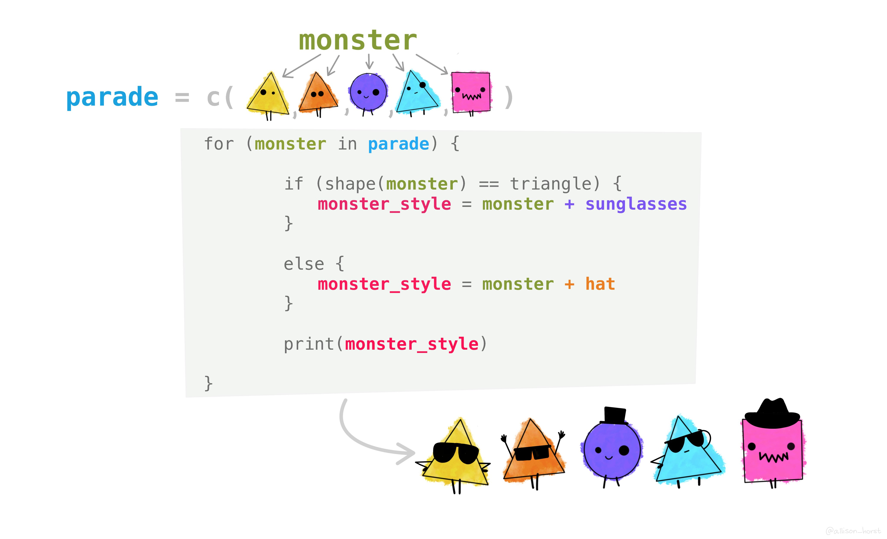
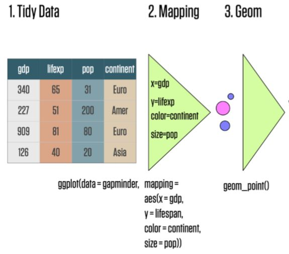

```{r xaringan-themer, include = FALSE}
library(xaringanthemer)
style_mono_accent(
  base_color = "midnightblue",
  header_font_google = google_font("Josefin Sans"),
  link_color = "steelblue",
  text_font_size = "26px",
  footnote_font_size = "22px"
)
```

```{r xaringanExtra, echo=FALSE}
xaringanExtra::use_xaringan_extra(c("tile_view", "logo", "tachyons"))
xaringanExtra::use_panelset()
xaringanExtra::use_tachyons()
```

```{r setup, include=FALSE}
options(htmltools.dir.version = FALSE)
```

class: center, middle

# For Loops

---


---


---


---



[Image from Allison Horst](https://github.com/allisonhorst/stats-illustrations)

---
class: center, middle

# Paths and Projects

---


---
class: center, middle

# Tidy Data

---


[Image from Allison Horst](https://github.com/allisonhorst/stats-illustrations)
---


[Image from Allison Horst](https://github.com/allisonhorst/stats-illustrations)

---
class: center, middle

# ggplot2 slides
---


[Image from Allison Horst](https://github.com/allisonhorst/stats-illustrations)

---



Image from Kieran Healy