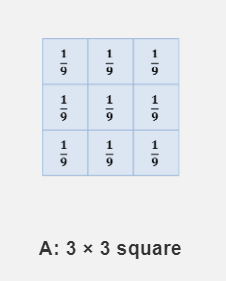
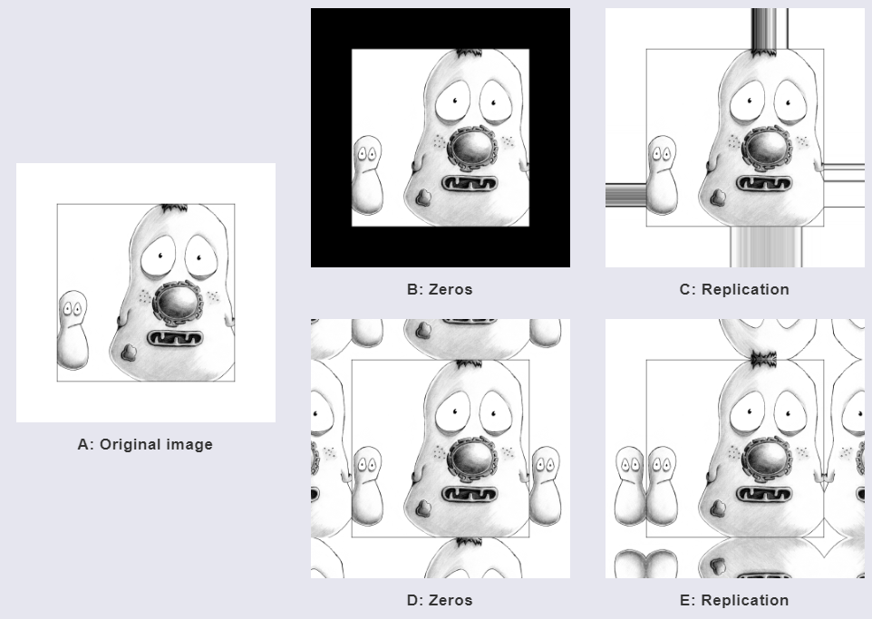
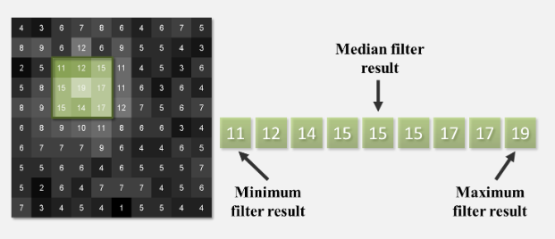
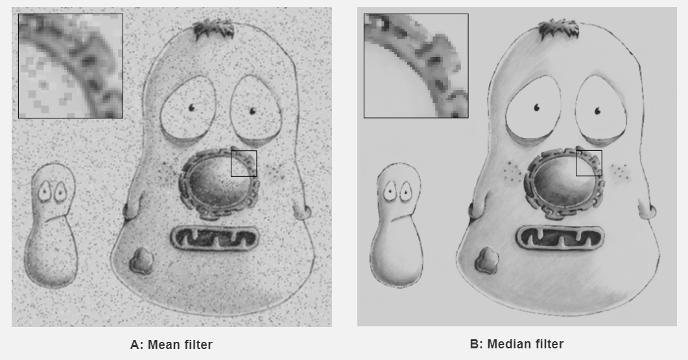
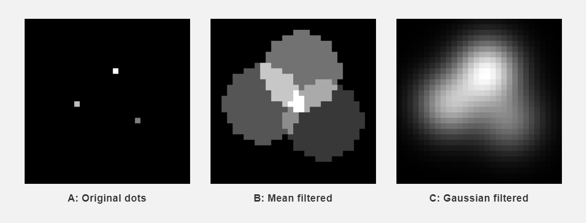

```{r xaringan-themer, include = FALSE}
library(xaringanthemer)
mono_light(
  base_color = "midnightblue",
  header_font_google = google_font("Josefin Sans"),
  text_font_google   = google_font("Montserrat", "300", "300i"),
  code_font_google   = google_font("Droid Mono"),
  link_color = "deepskyblue1",
  text_font_size = "28px"
)
```


# Sharing Session

- For 10 minutes a class, we'll discuss assignments

---
# Learning Objectives

- **Learn** about *histograms* and **use** them to understand the distribution of values in an image
- **Learn** about *numerical transformations* on image data and how to **apply** them to images
- **Learn** about *log transformation* and **assess** its effect on image data
- Learn about *filtering* and *denoising* images

---
# Glossary

- **transformation** - performing a numeric operation on the pixel values of an image
- **global** transformations - an operation that is applied to all of the pixel values at once. Also known as **point operations**.
- **local transformations** - an operation that is applied one pixel at a time, usually dependent on the *neighborhood* of this pixel. 
- **filtering** - a specific type of *local transformation* that uses a pixel value and the value of its neighboring pixels
- **neighborhood** - an area of pixels that is centered around one pixel. The smallest neighborhood is 3 pixels by 3 pixels = 9 pixels total, which form a "moat" around the center pixel.

---
# What are some problems with Microscope Images?

- Noise (often from Exposure)
- Uneven Illumination
- Overexposure

---
# First Do No Harm

- Do as little as possible to images when preprocessing them.
- Be Transparent and share your workflow

---
# Histograms

.pull-left[image]

.pull-right[histogram]

---
# Point Operations on Image

- Image too dark - try adding a value to the image
- 

---
# Normalization

- Scale depth of image to fit minimums and maximums of image

.pull-left[]

.pull-right[]

---
# Compare Histograms

.pull-left[]

.pull-right[]

---
# Log Transformation

- Sometimes we want to change the skewedness of an image's histogram
- Emphasize lower values, de-emphasize smaller values

---
# Masking

- We can use multiplication using a mask to remove irrelevant featres. 

---
# Noise in fluoresence microscopy

- Noise around an object can affect the *shape*, or *border* of the object that is detected
- We'll investigate the sources of noise further later
- Can affect the area that is measured for the object
- Can we fix this? Yes, we can, with *filters*!

---
# Filtering using a mean filter

.pull-left[
- Applying an operation using values around a pixel, or the pixel neighborhood
- Take all nine values in a neighborhood, multiply by 1/9, and then add them
- The "1/9" is known as a weight
]

.pull-right[
  
]


---
# Smoothing our image out


---
# What about the edges?

.pull-right[

]

---
# Variations: Median Filtering

.pull-left[
- Sort all values, and return the center value
- "ignores" extreme values in a neighborhood.
]

.pull-right[
  
]

---
# Mean vs Median: One ignores the "extreme" values



---
# Variations: Gaussian Filters

- Neighborhood and its weight are defined by 2-D *gaussian* functions around a point
- Avoids "blockiness"

.pull-right[
   
]

---
# What about Photoshop?

- Almost all effects in photoshop are global or local manipulations on an image.


---
# Take home points

- We can transform images with either **global** or **local** operations
- **Global operations**: transforming the data, including addition, subtraction, and scaling, or normalizing the data 
- We assess the effects of *global operations* by looking at the histogram
- **Local operations**: filtering, including mean filtering, median filtering, and gaussian filtering
- We assess the effects of local operations by examining the image and seeing the effect of the filter on downstream operations
- Neighborhoods define which pixel values we incorporate into a local operation

---
# Reading

Please read these sections before the lab.

- [Processing and Analysis](https://petebankhead.gitbooks.io/imagej-intro/content/chapters/processing_and_analysis/processing_and_analysis.html)
- [Point Operations](https://petebankhead.gitbooks.io/imagej-intro/content/chapters/point_operations/point_operations.html)