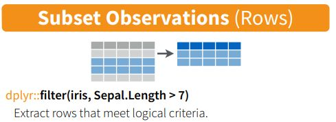
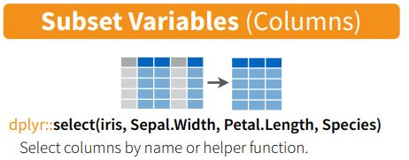

```{r xaringan-themer, include = FALSE}
library(xaringanthemer)
style_mono_accent(
  base_color = "midnightblue",
  header_font_google = google_font("Josefin Sans"),
  link_color = "steelblue",
  text_font_size = "26px",
  footnote_font_size = "22px"
)
```

```{r xaringanExtra, echo=FALSE}
xaringanExtra::use_xaringan_extra(c("tile_view", "logo", "tachyons"))
xaringanExtra::use_panelset()
xaringanExtra::use_tachyons()
```

```{r setup, include=FALSE}
options(htmltools.dir.version = FALSE)
```

class: center, middle

# What do I do with Errors?

---


---
# Understanding the difference between warnings and errors

- A *warning* is an indication that the data or arguments isn't quite what the function expected. 
    - You can usually run the code, but you should be careful about it and verify the output.

- An *error* means that the code can't execute at all given what you have given the function.
    - Errors can be difficult to understand, which is why


---
# Googling is StandaRd pRactice foR eRRors

The first thing I do when I encounter an error is to search for the error. I usually start with Google.

I don't know everything, and the odds are that I made a mistake in understanding the documentation.

There are some resources that I especially check (in order):

- RStudio Community (for `tidyverse`): https://community.rstudio.com/
- Stack Overflow: http://stackoverflow.com/
- Biostars (for Bioinformatics): https://www.biostars.org/
- The package's github page (especially issues)

---
# Have someone else look at your code

- We all have blind spots
- Someone else can more easily find the misplaced `{}`, `()`, or misspellings

---
# Usually, the error you're looking for is at the bottom

There will usually be a bunch of errors generated, but 

The one you're interested in is usually the last one.

---
# Where do I ask for help?

I'm trying to be as helpful as I can, but I can't answer all of your questions.

The following communities are extremely helpful to beginners:

- R for Data Science Community: https://r4ds.slack.com/  
    - Join here: http://r4ds.io/join
- RStudio Community: https://community.rstudio.com/ - especially for `tidyverse`/RStudio Questions

---


---


---



[`dplyr` cheatsheet](https://rstudio.com/wp-content/uploads/2015/02/data-wrangling-cheatsheet.pdf)

---



[`dplyr` cheatsheet](https://rstudio.com/wp-content/uploads/2015/02/data-wrangling-cheatsheet.pdf)

---
# dplyr cheatsheet

https://rstudio.com/wp-content/uploads/2015/02/data-wrangling-cheatsheet.pdf