```{r setup, include=FALSE}
knitr::opts_chunk$set(message=FALSE, warning=FALSE)
library(tidyverse)
library(gt)
library(janitor)
set.seed(666)
```

```{r xaringan-themer, include = FALSE}
library(xaringanthemer)
mono_light(
  base_color = "midnightblue",
  header_font_google = google_font("Josefin Sans"),
  text_font_google   = google_font("Montserrat", "300", "300i"),
  code_font_google   = google_font("Droid Mono"),
  link_color = "deepskyblue1",
  text_font_size = "28px"
)
library(xaringanExtra)
xaringanExtra::use_tachyons(minified = TRUE)
```

# Learning Objectives

- **Learn** about different types of machine learning
- **Learn** how to split data using `{rsample}`
- **Learn** about standard approaches for preprocessing data using `{recipes}`
- **Learn** about PCA as a visualization and exploration technique
- **Learn** the basic phases of supervised machine learning and the `tidymodels` functions associated with them
- **Learn how to evaluate** the predictive power of a model/learner

---

# What is Machine Learning?

- "The study of computer algorithms that improve automatically through experience"
- Using algorithms to find predictive patterns in the data

---
# Types of Machine Learning

- **Unsupervised** - discovering groups in data without labels
  - Dimension reduction, clustering
  - Goal is discovery and exploration, not prediction
- **Supervised** - learning how to predict labels using *features*/*covariates*
  - Labels: 
- **Reinforcement** - guided machine learning
  

---
# What's the Difference?

.pull-left[
## Statistical Modeling

- Understand and quantify relationships between covariates and outcome is primary goal
- Prediction is secondary
- Sample sizes tend to be smaller
]

.pull-right[
## (Supervised) Machine Learning

- Prediction is primary goal
- Understanding relationships between variables is secondary
- Sample sizes tend to be very large
]

---
# `tidymodels`

General framework for machine learning, allows you access to many different machine learning packages, such as TensorFlow

Learn one workflow, use many different algorithms!

---
# The different parts of `tidymodels`

The different sections of `tidymodels` are designed to be useful in a `tidy` workflow and roughly map to the different steps and requirements of a machine learning workflow.

---

## Let's run through a basic `tidymodels` workflow

These are the major packages where `tidymodels` is used in machine learning.

-   `{rsample}` - use these functions to specify a test/training set, or to build a cross-validation set, or for bootstrap sampling
-   `{recipes}` - use these functions to normalize variables and process them for use in machine learning, also known as **feature engineering**.
-   `{parsnip}` - use these functions to specify and train your model
-   `{workflows}` - use a model and recipe together (allows you to switch out models and use them reproducibly)
-   `{yardstick}` - use these functions to evaluate your model (accuracy on test data)

---
# Workflow

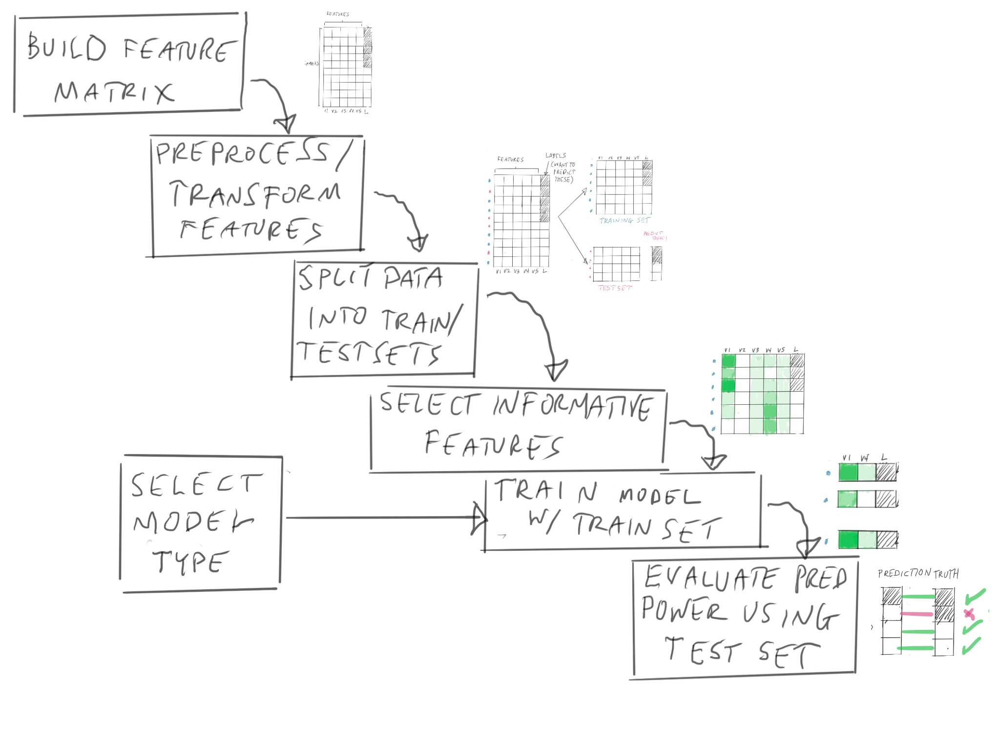

---
# Workflow with Packages


---
# Starting Data

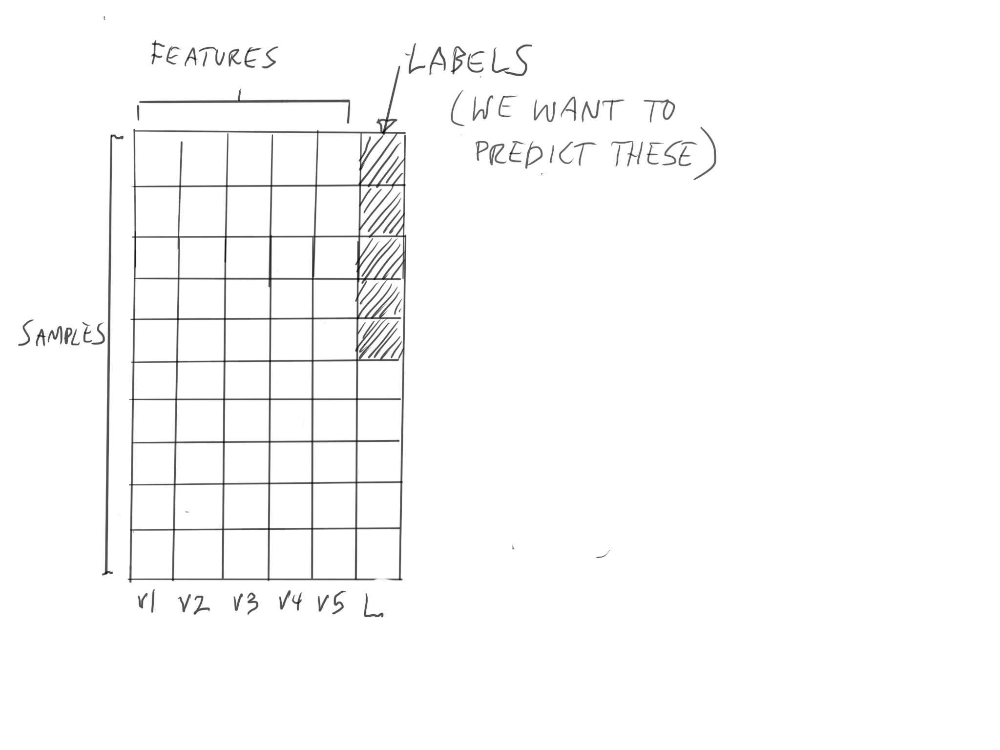

---

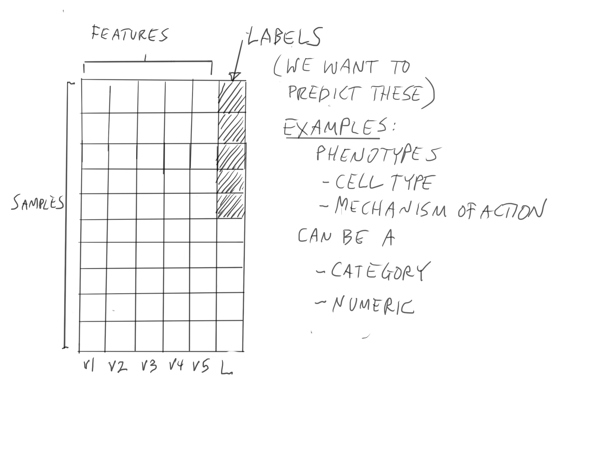

---

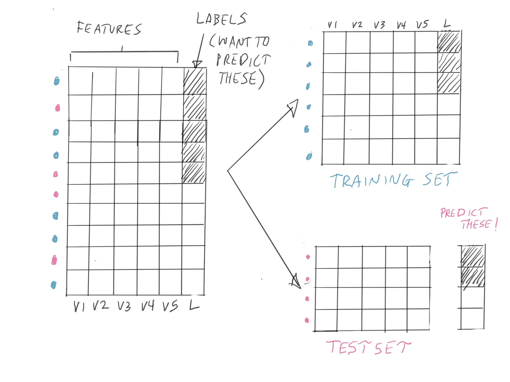

---

# `rsample::initial_split()`

The function `initial_split()` from `rsample` package in `tidymodels` handles splitting data into test/train sets.

```{r eval=FALSE}
all_features_split <- initial_split(all_features, 
                                prop = 3/4)
all_features_train <- training(all_features_split)
all_features_test <- testing(all_features_split)
```


---
# `recipes`

The `recipes` package in `tidymodels` outlines approaches to transform data, using `step_` functions

https://www.tidymodels.org/start/recipes/

```
recipe(species ~., data = penguins) %>%
  update_role(species, island, new_role="id") %>%
  step_normalize(all_numeric()) #<<
```
---
# Data Types

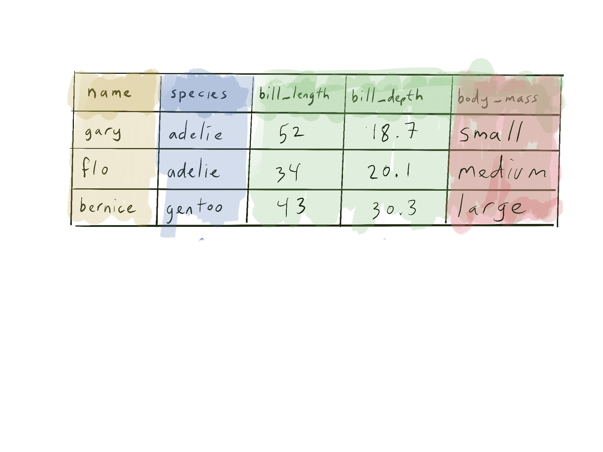

---
# Data Types

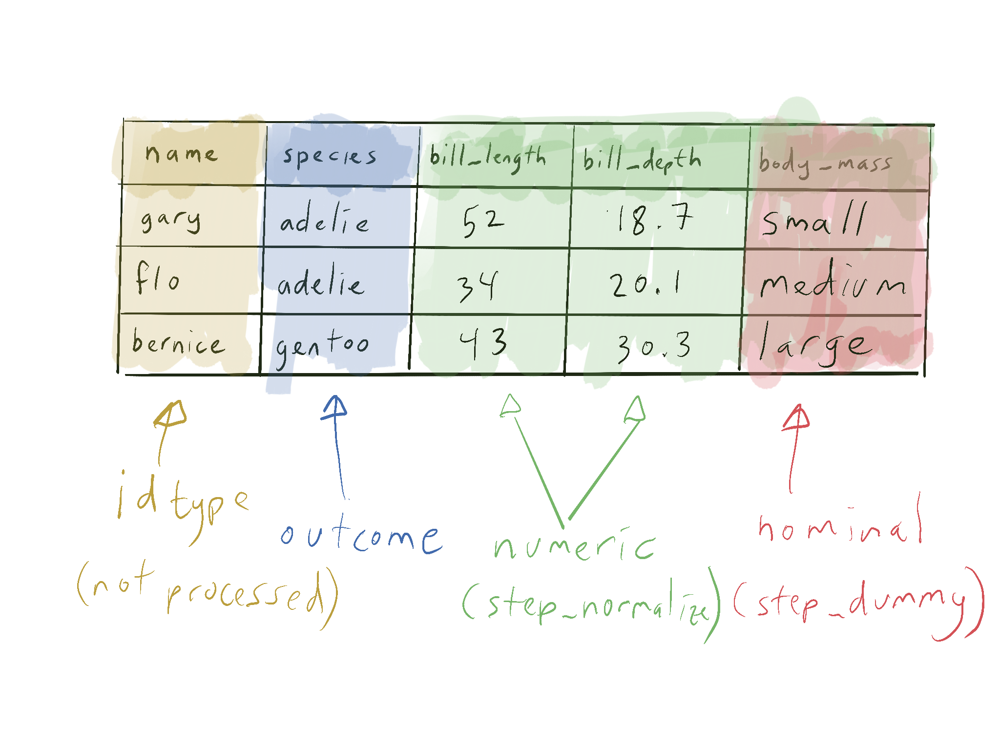

---
# Building a `recipe`

- Many standardized steps for processing data in machine learning

---

```{r echo=FALSE}
read.csv("steps.csv") %>%
  knitr::kable(format = "html", escape = FALSE)
```
---
# Build a recipe once, use it on different data

- usually apply it to our training set first
- then apply it to the test set

---
# PCA: Principal Components Analysis

- Visualization method
- Summarize many covariates into a smaller number of "Prinicipal Components"
- Principal components "squish" multiple covariaes into linear combinations
- Values of linear combinations chosen to maximize variability

---
# Clustering: Examining groupings in the data

 

---


---
# Training Data Workflow


---
# Test Data Workflow


---
# Fitting the Model

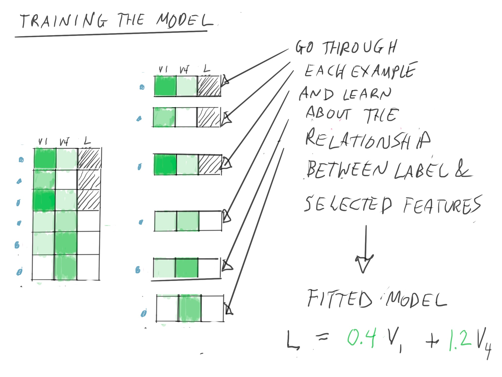

---
# {yardstick} for evaluating on test set

`collect_metrics()` from `tidymodels` allows you to calculate metrics on predictions including:

- Accuracy
- Balanced Accuracy
- Sensitivity (requires an "event_level", such as "depressed")
- Specificity (requires an "event_level", such as "depressed")
- Area under the Reciever Operating Curve (ROC)

---
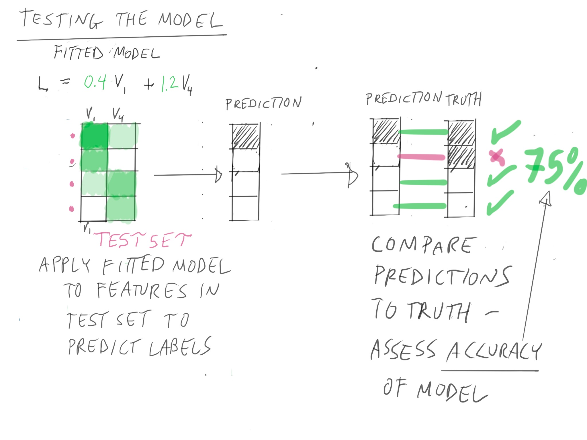 

---
# Logistic Regression

Talk more about this in RStudio cloud notebook.


---
# K-nearest Neighbor

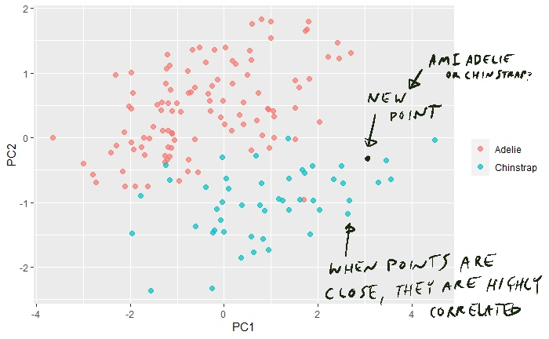

---

# K-nearest Neighbor

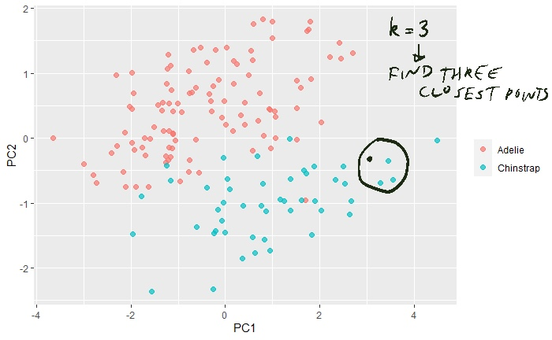

---

# K-nearest Neighbor

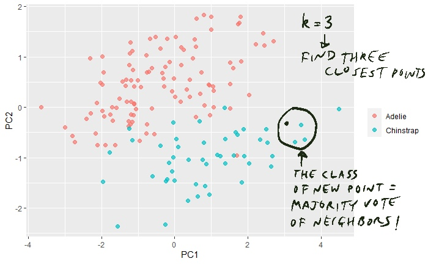
